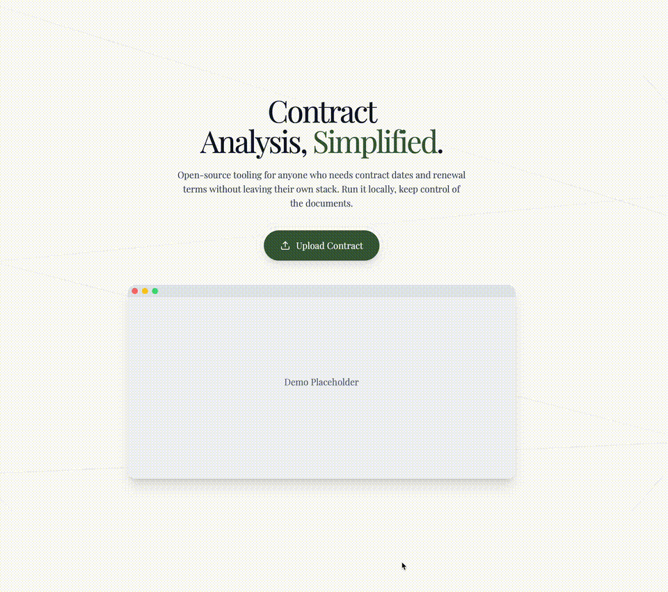

# Contract Extraction Assistant

> **Your personal contract extraction assistant.** Bring your own API key, keep your data local, and extract contract terms in seconds—not minutes.

## Demo Mode Notice

This project is currently running in **Demo Mode** using a **shared API key**.  
Intended **for testing and demonstration only**.

### Important:
- Do **not** upload sensitive or confidential documents.
- Documents processed in demo mode **may be logged or used for model training**.
- For full privacy and production-grade performance:
  - **Bring your own API key (BYOK)** — instructions available on the **hero page** and in the **Quick Start** section.

## 🎥 Demo



---
## Performance Benchmarks

**Hardware:** M1 Mac  
**Test Set:** 5 contracts, 97 pages total

---

### Single Document (5 pages)

| Method | Time to Complete | Page References Included? |
|:--|:--|:--|
| **This Tool** | **3.09s** | ✅ Yes (with snippets) |
| General LLM (chat interface) | ~7s | ✅ Yes |
| **Difference** | **2.3× faster** | - |

---

### Batch Processing (5 contracts, 97 pages)

| Method | Processing Approach | Time to First Result | Time to Complete All | Output Format |
|:--|:--|:--|:--|:--|
| **This Tool** | Concurrent | ~2s | ~9s | ✅ Structured JSON/CSV |
| General LLM (chat interface) | Sequential | ~22s | ~86s | ❌ Text responses |
| **Difference** | Parallel vs Sequential | **11× faster** | **9.5× faster** | Ready to export |

---

## Why Concurrent Processing Matters

Traditional workflows process contracts one at a time (upload → wait → next file → wait...).

This tool:
- Uploads all contracts simultaneously  
- Processes in parallel  
- Returns structured data ready for export  
- Waits for the slowest file, not the sum of all files  

**Result:** As batch size grows, the time advantage compounds.

---

## Current Status

**What works:**
- Fast concurrent extraction (proven above)  
- 4 core fields: start date, end date, renewal terms, termination notice  
- Page references included  
- Export to JSON/CSV/PDF

**In progress:**
- Snippet extraction: ~50% reliability (being improved)  
- Full accuracy benchmark: Testing across 500 contracts (coming soon)  

This is an active development project. Speed and scalability advantages are proven; accuracy metrics and edge case handling are being refined.

---
## Why This Exists

Traditional contract analysis means:
- Uploading sensitive documents to third-party platforms
- Waiting for bloated, inconsistent LLM responses
- Manually parsing through walls of text
- No control over your data or extraction logic

**Contract Extraction Assistant** flips the script:
- **100% local processing** - PDFs never leave your machine (only prompts hit the API)
- **Lightning fast** - 10 seconds for 4 contracts (89 pages total)
- **Structured exports** - JSON, CSV, TXT, or PDF—your choice
- **Consistent accuracy** - LLM intelligence + regex precision = reliable extractions
- **BYOK model** - Bring your own Mistral API key, pay only for what you use

Built for anyone who processes contracts at scale—whether you're cutting labor costs, triaging stacks of agreements, or need a reusable extraction pipeline that respects your data.

---

## What It Does

Upload a contract PDF and instantly extract:
- **End Date** - Contract expiration or term end
- **Renewal Terms** - Auto-renewal clauses and conditions
- **Termination Notice Period** - Required notice for cancellation

Each extraction shows:
- **The extracted value**
- **Source attribution (LLM inference or regex pattern)**
- **Expandable source details** with page numbers, extraction method, and reference snippets for quick verification
- **Contract metadata (length, pages analyzed)**
- **Extraction timestamp**

The **source details viewer** allows you to inspect the extraction process in detail. Click on the **Expand** button next to each field to see:
- Page numbers where the extraction occurred
- The extraction method used (LLM or regex)
- Reference snippets from the contract PDF

### Batch Processing
Upload multiple contracts simultaneously—the system processes them concurrently for maximum throughput. Recent benchmark: **4 contracts (89 pages) in 10 seconds**.

---

## Architecture

**Hybrid extraction pipeline:**
1. **LLM-first** - Mistral handles nuanced language and contextual interpretation
2. **Regex fallback** - Curated patterns catch what LLMs miss or provide faster extraction
3. **Structured output** - Clean, consistent JSON responses every time

**Stack:**
- **Backend**: Flask API with PyMuPDF for parsing, Mistral SDK for inference, spaCy for NLP
- **Frontend**: React + Vite dashboard with Tailwind UI
- **Patterns**: YAML-based regex library for the four core fields

---

## Quick Start

### Prerequisites
- Docker Desktop or another Docker runtime (for one-command setup)
- Python 3.8+ and Node.js 16+ (only needed for manual install)
- Mistral API key

### Get Started with Mistral AI

1. **Sign up** at [Mistral AI](https://mistral.ai/)
2. **Choose your plan**:
   - **Experiment (Free)**: For testing and development. Note that data may be used for training.
   - **Pay-As-You-Go**: For production use with data privacy guarantees.
3. **Create an API key** in the Mistral AI dashboard
4. **Set up your environment**:
   ```bash
   # Create a .env file in the project root with your key:
   echo "MISTRAL_API_KEY=your_api_key_here" > .env
   ```
   Replace `your_api_key_here` with your actual Mistral API key.

   > 🚨 **Critical**: You must create this `.env` file *before* running `docker compose up`. The container needs this file at startup to enable Mistral AI features. If the key is missing, the system will fall back to regex-only mode with limited functionality.

> **Note**: The free "Experiment" plan is perfect for testing, but be aware that Mistral may use your API requests to improve their models. For production use or sensitive data, consider a paid plan.

---

### Option 1 — Docker (one command)

1. **Clone & configure**
   ```bash
   git clone <repo-url>
   cd contract-analysis-lite
   ```
2. **Provide your API key** (BYOK). Either export it inline:
   ```bash
   export MISTRAL_API_KEY=sk_your_real_key
   ```
   or create a `.env` file in the project root containing `MISTRAL_API_KEY=sk_your_real_key`.
3. **Start the stack**
   ```bash
   docker compose up --build
   ```
   This launches the Flask backend (http://localhost:5000) and the Vite frontend (http://localhost:5173).

   > ⚠️ **Important**: Make sure to create the `.env` file with your Mistral API key *before* running `docker compose up`. If the API key is not found, the system will fall back to regex-only mode with reduced accuracy.
4. **Open the app** at `http://localhost:5173`, upload a PDF, and watch the results stream in.

> Want to stop the containers? Run `docker compose down`.

---

### Option 2 — Manual setup (Python + Node)

1. **Clone & configure**
   ```bash
   git clone <repo-url>
   cd contract-analysis-lite
   cp .env.example .env
   ```
   Edit `.env` and add your key:
   ```
   MISTRAL_API_KEY=sk_your_real_key
   ```
2. **Start the backend**
   ```bash
   cd backend
   python -m venv .venv
   source .venv/bin/activate  # On Windows: .venv\Scripts\activate
   pip install -r requirements.txt
   python app.py
   ```
   The API listens on `http://localhost:5000`.
3. **Start the frontend** (in a new shell at the repo root)
   ```bash
   npm install
   npm run dev
   ```
   Vite serves the dashboard on `http://localhost:5173`.
4. **Upload & extract**
   Drag a contract PDF into the dashboard, click **Analyze**, and download the structured output.

---

## Export Options

All extractions can be exported as:
- **JSON** - Machine-readable structured data
- **CSV** - Spreadsheet-friendly format for batch analysis
- **TXT** - Plain text for documentation
- **PDF** - Formatted report with extraction details

---

## Roadmap

**Next up:**
- **Docker deployment** - One-command setup for the entire stack
- **Hosted web interface** - Optional plug-and-play SaaS version (if demand warrants)

**Under consideration:**
- **Multi-provider support** - OpenAI, Anthropic Claude, Cohere, or any OpenAI-compatible API
- Expanded field library (payment terms, liability caps, jurisdiction clauses)
- Visual PDF annotation (highlight extracted clauses in-context)
- Multi-language support (contracts in Spanish, German, French, etc.)
- Advanced audit trail (step-by-step extraction logs)
- Custom pattern builder (define your own extraction rules via UI)
- Integration hooks (webhooks, REST API, file watchers)

**Have a feature request?** Open an issue—this tool evolves based on real user needs.

---

## Performance

**Benchmarks on a modern laptop:**
- Single contract (12-page PDF): ~3 seconds
- Batch (4 contracts, 89 pages): ~10 seconds
- Concurrent uploads: Up to 10 contracts processed simultaneously

**Why it's fast:**
- Parallel processing for batch jobs
- Efficient PDF text extraction (PyMuPDF)
- Windowed context sent to LLM (not entire document)
- Regex pre-filters reduce API calls

---

## Privacy & Security

- **PDFs stay local** - Only prompt text is sent to your chosen LLM provider
- **No vendor lock-in** - Mistral is the default for easy testing, but the system is designed for multi-provider support (OpenAI, Anthropic, Cohere, etc.)
- **BYOK model** - You control the API key, provider choice, and billing
- **No data retention** - Most providers don't train on API calls (verify your provider's policy)
- **Self-hosted option** - Run the entire stack on your infrastructure

This tool is designed for sensitive contract analysis where data sovereignty and provider flexibility matter.

---

## Example Output

```json
{
  "extraction_timestamp": "2025-10-03T14:32:11Z",
  "contract_type": "General Agreement",
  "contract_length": 12345,
  "pages_analysed": 7,
  "analysis": {
    "start_date": {
      "value": "January 1, 2024",
      "source": "Inference"
    },
    "end_date": {
      "value": "December 31, 2024",
      "source": "Regex"
    },
    "renewal_terms": {
      "value": "Automatically renews for successive one-year terms unless terminated with 60 days written notice",
      "source": "Inference"
    },
    "termination_notice_period": {
      "value": "30 days written notice",
      "source": "Regex"
    }
  }
}
```

---

## Technical Details

### Backend (`backend/`)
- `app.py` - Flask API with `/api/analyze-contract` endpoint
- `contract_extractor.py` - Core extraction logic (LLM + regex hybrid)
- `patterns/` - YAML pattern definitions for each field
- `requirements.txt` - Python dependencies

### Frontend (`src/`)
- `UploadModal.tsx` - Multi-file upload with drag-and-drop
- `Dashboard.tsx` - Results display and export controls
- Tailwind-styled responsive UI

### Patterns Library
Each field has a corresponding YAML file in `backend/patterns/`:
- `start_date.yaml`
- `end_date.yaml`
- `renewal_terms.yaml`
- `termination_notice.yaml`

Add new patterns by creating additional YAML files and registering them in `contract_extractor.py`.

---

## Support & Contributing

**Found this useful?** ⭐ Star the repo to show your support and help others discover it.

Contributions welcome! Areas of interest:
- **New extraction patterns** - Add fields like payment terms, indemnity clauses, etc.
- **Language support** - Expand beyond English contracts
- **UI/UX improvements** - Better visualizations, error handling, accessibility
- **Performance optimization** - Faster parsing, smarter caching
- **Documentation** - Tutorials, integration guides, pattern authoring docs

**How to contribute:**
1. Fork the repo
2. Create a feature branch (`git checkout -b feature/amazing-improvement`)
3. Commit your changes (`git commit -m 'Add amazing improvement'`)
4. Push to the branch (`git push origin feature/amazing-improvement`)
5. Open a Pull Request

**Get help:**
- **Issues**: [GitHub Issues](link-to-issues)
- **Questions**: Open a GitHub issue with the "question" label

---

## License

MIT License - See [LICENSE](LICENSE) for details.

This means you can:
- ✅ Use commercially
- ✅ Modify and distribute
- ✅ Use privately
- ✅ Sublicense

Attribution appreciated but not required.