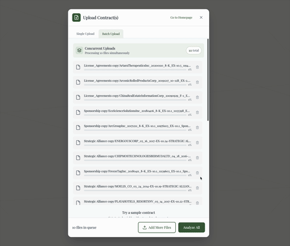

# Contract Extraction Assistant

> Extract contract terms in seconds, not minutes. Local-first, structured output, built for batch processing.

## 🎥 Demo



---

## Quick Start

**Zero setup required:**

```bash
git clone https://github.com/Qleric-labs/contract-extraction-assistant
cd contract-extraction-assistant
docker compose up
```

Open **http://localhost:5173** → Upload PDF → Extract

**Demo mode active** - Works immediately with shared API key.

⚠️ **Demo limitations:**
- Shared quota (refresh daily)
- Data may be used for training
- Don't upload confidential contracts

**Want unlimited + private?** Add your own Mistral key (free tier available) - see [Production Setup](#production-setup) below.

---

## What It Does

**Extracts 4 key fields from contracts:**
- Start date
- End date  
- Renewal terms
- Termination notice period

**Output formats:** JSON, CSV, PDF, TXT

**Key features:**
- Concurrent batch processing
- Page references + audit trail
- Local PDF processing (only prompts sent to API)
- Structured data ready for analysis

---

## Performance

**Hardware:** M1 Mac

| Test | Time | Details |
|------|------|---------|
| **Single contract** (5 pages) | 3s | Includes page refs + snippets |
| **Batch** (10 contracts, 150 pages) | <10s | Concurrent processing |
| **General LLM** (same 10 contracts) | ~2-3 min | Sequential upload/processing |

**Why it's faster:**
- Parallel processing (not one-at-a-time)
- Purpose-built prompts (not general chat)
- Structured output (no manual formatting)

---

## Production Setup

**Get your own Mistral API key:**

1. Sign up at [console.mistral.ai](https://console.mistral.ai)
2. Free tier or Paid 
3. Create `.env` file:
   ```bash
   MISTRAL_API_KEY=your_key_here
   ```
4. Restart: `docker compose restart`

**Your key = unlimited usage + data privacy control**

---

## Roadmap

**Shipping next:**
- Additional extraction fields (payment terms, liability, jurisdiction)
- Multi-provider support (OpenAI, Anthropic, Cohere)
- Accuracy benchmarks (testing across 500 contracts)

**Under consideration:**
- Visual PDF annotation (highlight extracted text)
- Multi-language support
- Custom extraction rules builder

---

## Technical Stack

**Backend:** Flask + PyMuPDF + Mistral SDK + spaCy  
**Frontend:** React + Vite + Tailwind  
**Extraction:** Hybrid LLM + regex patterns

See [Technical Details](#technical-details) for architecture breakdown.

---

## Export Formats

All extractions export as:

- **JSON** - Machine-readable
- **CSV** - Spreadsheet-ready
- **PDF** - Formatted report
- **TXT** - Plain text

---

## Privacy

- PDFs processed locally (only prompts sent to API)
- BYOK model (you control the key)
- No vendor lock-in (multi-provider support planned)
- Self-hosted (run on your infrastructure)

Demo mode uses shared key - suitable for testing only.

---

## Contributing

⭐ **Star this repo if you find it useful** - helps others discover it.

**Want to contribute?**
- New extraction patterns
- UI/UX improvements
- Multi-language support
- Performance optimizations

See [CONTRIBUTING.md](CONTRIBUTING.md) for guidelines.

---

## Technical Details

<details>
<summary>Click to expand architecture details</summary>

### Backend (`backend/`)
- `app.py` - Flask API with `/api/analyze-contract` endpoint
- `contract_extractor.py` - LLM + regex hybrid logic
- `patterns/` - YAML pattern definitions
- `requirements.txt` - Python dependencies

### Frontend (`src/`)
- `UploadModal.tsx` - Multi-file upload
- `Dashboard.tsx` - Results display + export controls
- Tailwind-styled responsive UI

### Extraction Pipeline
1. **LLM-first** - Mistral handles nuanced language
2. **Regex fallback** - Catches what LLMs miss
3. **Structured output** - Clean JSON every time

### Performance Optimizations
- Parallel processing for batch jobs
- Windowed context (not full document to LLM)
- Efficient PDF parsing (PyMuPDF)
- Regex pre-filters reduce API calls

</details>

---

## Example Output

```json
{
  "extraction_timestamp": "2025-10-09T14:32:11Z",
  "contract_type": "Service Agreement",
  "contract_length": 12345,
  "pages_analysed": 7,
  "analysis": {
    "start_date": {
      "value": "January 1, 2024",
      "source": "LLM",
      "page": 2
    },
    "end_date": {
      "value": "December 31, 2024",
      "source": "Regex",
      "page": 2
    },
    "renewal_terms": {
      "value": "Auto-renews annually unless 60 days written notice given",
      "source": "LLM",
      "page": 5
    },
    "termination_notice_period": {
      "value": "30 days written notice",
      "source": "Regex",
      "page": 6
    }
  }
}
```

---

## License

MIT License - See [LICENSE](LICENSE) for details.

Use commercially, modify, distribute freely. Attribution appreciated but not required.

---

## Support

- **Issues:** [GitHub Issues](https://github.com/Qleric-labs/contract-extraction-assistant/issues)
- **Questions:** Open an issue with "question" label

---

**Built for anyone processing contracts at scale.**